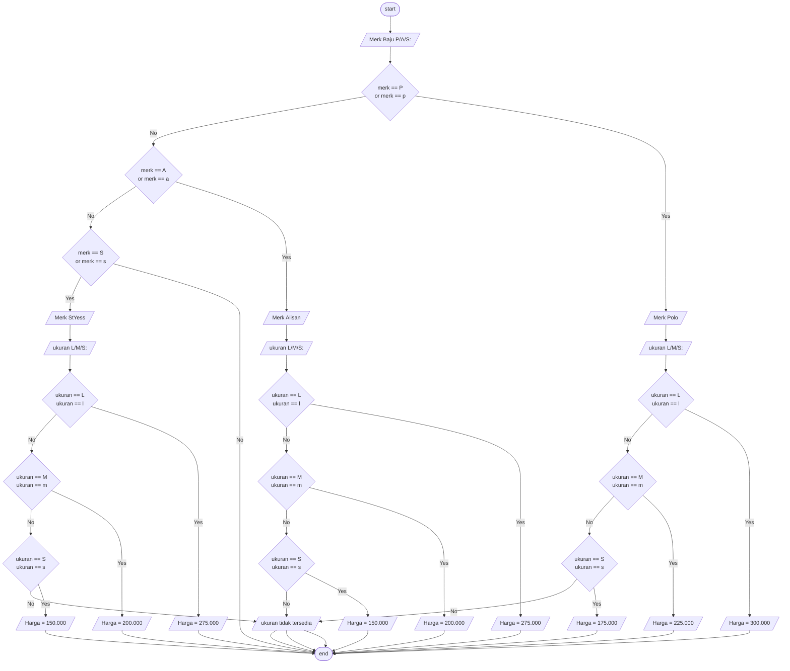

```mermaid
flowchart TD

s([start])
e([end])
merk[/"Merk Baju P/A/S: "/]
cP{"merk == P
or merk == p"}
cA{"merk == A
or merk == a"}
cS{"merk == S
or merk == s"}
polo[/"Merk Polo"/]
ukuran[/"ukuran L/M/S: "/]
ukuranA[/"ukuran L/M/S: "/]
cPL{"ukuran == L
ukuran == l"}
oPL[/"Harga = 300.000"/]
cPM{"ukuran == M
ukuran == m"}
oPM[/"Harga = 225.000"/]
cPS{"ukuran == S
ukuran == s"}
oPS[/"Harga = 175.000"/]
oE[/"ukuran tidak tersedia"/]

alis[/"Merk Alisan"/]
cAL{"ukuran == L
ukuran == l"}
oAL[/"Harga = 275.000"/]
cAM{"ukuran == M
ukuran == m"}
oAM[/"Harga = 200.000"/]
cAS{"ukuran == S
ukuran == s"}
oAS[/"Harga = 150.000"/]

st[/"Merk StYess"/]
ukuranS[/"ukuran L/M/S: "/]
cSL{"ukuran == L
ukuran == l"}
oSL[/"Harga = 275.000"/]
cSM{"ukuran == M
ukuran == m"}
oSM[/"Harga = 200.000"/]
cSS{"ukuran == S
ukuran == s"}
oSS[/"Harga = 150.000"/]

s-->merk
merk-->cP
cP-->|No|cA
cP-->|Yes|polo
polo-->ukuran
ukuran-->cPL
cPL-->|No|cPM
cPL-->|Yes|oPL
oPL-->e
cPM-->|No|cPS
cPM-->|Yes|oPM
oPM-->e
cPS-->|No|oE
cPS-->|Yes|oPS
oE-->e
oPS-->e

cA-->|No|cS
cA-->|Yes|alis
alis-->ukuranA
ukuranA-->cAL
cAL-->|No|cAM
cAL-->|Yes|oAL
oAL-->e
cAM-->|No|cAS
cAM-->|Yes|oAM
oAM-->e
cAS-->|No|oE
cAS-->|Yes|oAS
oE-->e
oAS-->e

cS-->|Yes|st
cS-->|No|e
st-->ukuranS
ukuranS-->cSL
cSL-->|No|cSM
cSL-->|Yes|oSL
oSL-->e
cSM-->|No|cSS
cSM-->|Yes|oSM
oSM-->e
cSS-->|No|oE
oE-->e
cSS-->|Yes|oSS
oSS-->e

```
